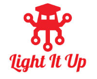
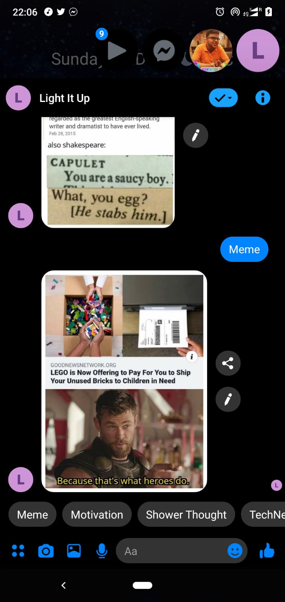
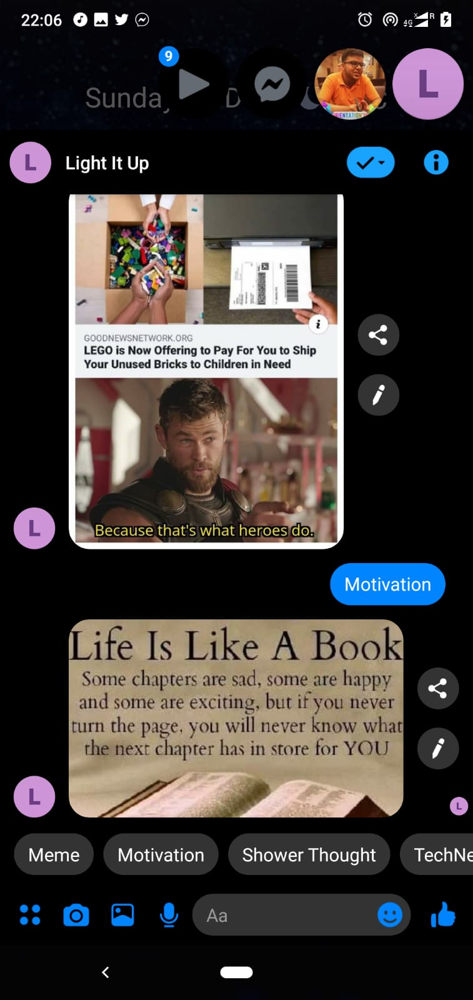
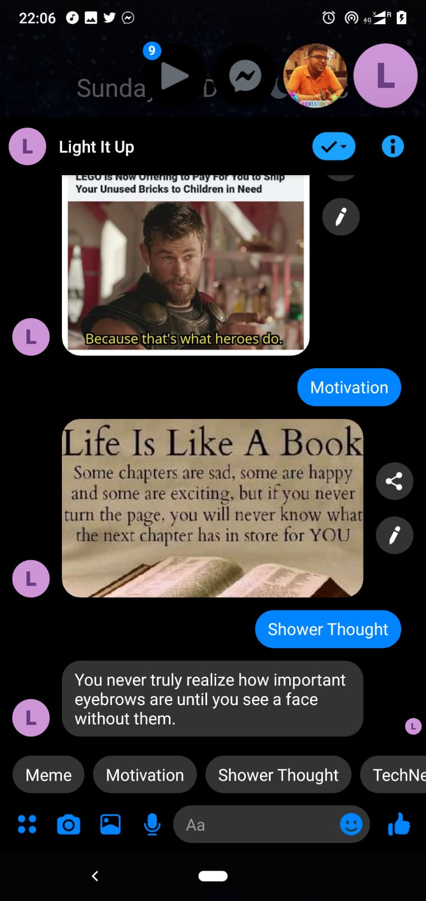
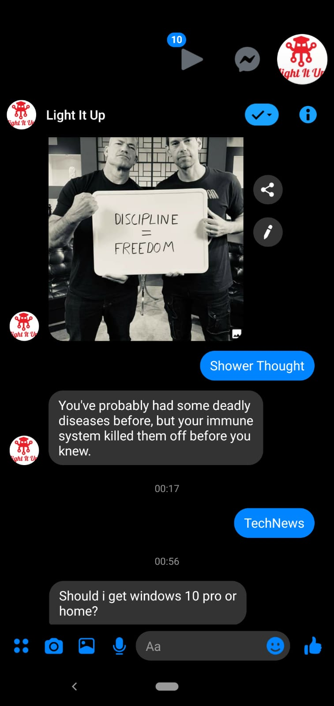
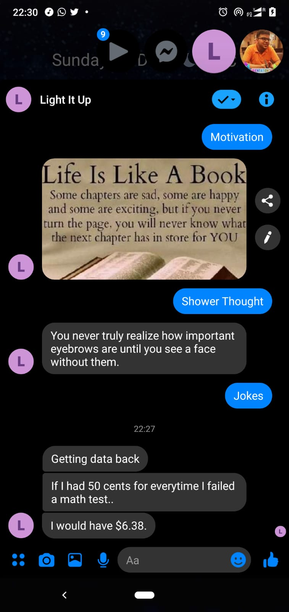

<h1 align="center">:robot: Light It Up! :robot:</h1>

 

 

---

<h2>Motivation:</h2>

Bored on weekends here in Delhi. Hence, decided to make a bot that helps me lighten my mood by being able to instantly get memes, motivational thoughts, jokes and tech news at one click. 

### Goals of this project:

* [x] Learn chatbot development (at least rule based)
* [x] Learn how to deal with external APIs in Messenger. 
* [x] Deal with message type other than text and how to pipeline it to corresponding user. 
* [x] Cut out boredom. 

---

<h3 align="center">Screenshots:</h3>

<h4 align="center">Meme</h4>

 
<h4 align="center">Motivation</h4>

 
<h4 align="center">Shower Thought</h4>

 
<h4 align="center">TechNews</h4>

 
<h4 align="center">Jokes</h4>

 

---
#### To talk with my chatbot at http://m.me/lightenthat, contact me on WhatsApp for dev access as my bot isn't public yet. (Selective people only).

### Future scope of this project:

* [ ] Add more subreddits to fetch from. 
* [ ] Incorporate NLP to search based on user query. 

### Tech Stack of this Project:

* Backend: Python3
* Framework: Flask
* Database: PostgreSQL
* Dependencies: Facebook Messenger, Reddit 
* Libraries: Available in [requirements.txt](https://github.com/arghyadeep99/Light-It-Up/blob/master/requirements.txt).

#### This project still has scope of development, so you can also contribute to this Project as follows:
* [Fork](https://github.com/arghyadeep99/Light-It-Up) this Repository.
* Clone your Fork on a different branch:
	* `git clone -b <name-of-branch> https://github.com/arghyadeep99/Light-It-Up.git`
* After adding any feature:
	* Goto your fork and create a pull request.
	* We will test your modifications and merge changes.

This project was done `in my freetime here in Delhi as I am pretty much bored on weekends.`

---
<h3 align="center"><b>Developed with :heart: by <a href="https://github.com/arghyadeep99">Arghyadeep Das</a>.</b></h1>
